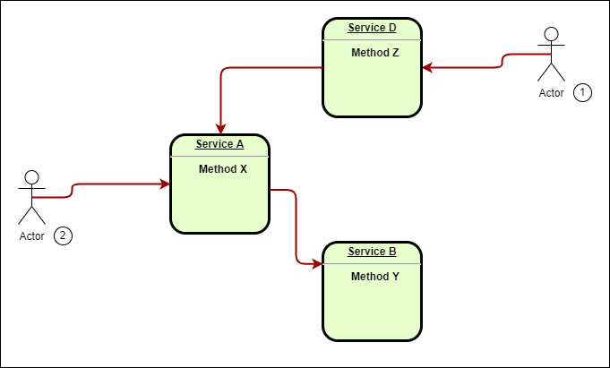
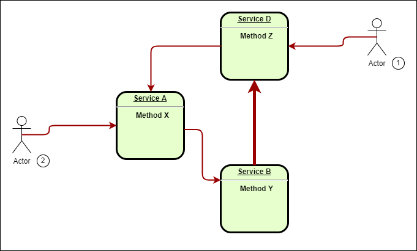

# Distributed Loop

## Overview

This library detect and solve distributed loop problem.

Below there are the instructions to use this library.

If you don't know what distributed loop is beleow there is documentation about it.

### How to use this libray in asp.net core

- Install the nuget package "SPS.DistributedLoopDetector"
- in program.cs of your webapp add this using

```C#
using DistributedLoopDetector;
```

- in program.cs of your webapp add the instruction commented with arrow

```C#
//...
var builder = WebApplication.CreateBuilder(args);
//...
builder.Services.AddDistributedLoopDetector(); // <--- add this line of code to activate loop detection
//...
```

You must use IHttpClientFactory to create HttpClient and do http calls

When distributed loop is detected, method that starts the loop will has the HTTP 508 error status code (Loop Detected) and loop will be immediately stopped.

### How to use this libray in Azure Function

- Install the nuget package "SPS.DistributedLoopDetectorFunc" (in beta version right now)
- in program.cs of your webapp add this using

```C#
using SPS.DistributedLoopDetectorFunc;
```

- in program.cs of your webapp add the instruction commented with arrow

```C#
//...
var host = new HostBuilder()

    .ConfigureFunctionsWorkerDefaults(workerApplication =>
    {
        // Register our custom middlewares with the worker
        workerApplication.UseDistributedLoopDetector();
    })    
    .ConfigureServices(services => services.AddFuncDistributedLoopDetector()) //<-- Add services.AddFuncDistributedLoopDetector()
    .Build();
//...
```

- Create constructor for you function that require IHttpClientFactory like example below

```C#
//...
private readonly IHttpClientFactory _httpClientFactory;
public FunctionDLoopD(ILoggerFactory loggerFactory, IHttpClientFactory httpClientFactory)
{
    _logger = loggerFactory.CreateLogger<FunctionDLoopD>();
    _httpClientFactory = httpClientFactory;
}
//...
```

- Use IHttpClientFactory to make http calls

```C#
//...
        [Function("DistributedLoopFunction")]
        public async Task<HttpResponseData> Run([HttpTrigger(AuthorizationLevel.Function, "get", "post")] HttpRequestData req, FunctionContext functionContext)
        {
                var httpRequestMessage = new HttpRequestMessage(
                            HttpMethod.Get,
                            "https://localhost:7144/api/Ping/Ping");

                var httpClient = _httpClientFactory.CreateClient();
                var httpResponseMessage = await httpClient.SendAsync(httpRequestMessage);

//...
```

When distributed loop is detected, method that starts the loop will has the HTTP 508 error status code (Loop Detected) and loop will be immediately stopped.

## What distributed loop is?

It's like a infinite loop such

```C#
while(true)
{
//...
} 
```

and has some aspects like infinite recursion

```C#
void foo()
{
    foo();
}
```

Infinite recursion stops with stack overflow error but distributed loop doesn't :(

In this issue there are at least 2 process or services that conmunicate with each other.
They can communicate in many way such socket, http, web api etc...

## Simple scenario


In this image we can see an example of the simpliest scenario.

- At starting point 0 someone or something interact with Method X of Service A
- Service A start a new thread (thread 1 on Service A) to execute Method X, and at point 1 Method X call Method Y of Service B. (Method X doesn't know the implementation of Method Y)
- Method X at this time is waiting for the response of Method Y
- Service B start a new thread (thread 1 on Service B) to execute the Method Y
- Method Y make a call to Method X of Service A (point 2) and wait for the response

**Remember: in Service A there is thread 1 waiting for Service B response but this isn't a deadlock because service A create a new thread to answer at the new request for Method X.**

- Service A create a new thread (thread 2) to handle the new call to Method X, and in this thread make a call to Method Y of Service B (point 3)

**Note: in Service B there is thread 1 on Method Y that is waitng for an answer from Method X.**

- Service B create a new thread (thread 2) to handle the new call to Method X, and in this thread it make a call to Method Y of Service B (point 4).

And so on...
Every time Service A call Service B ther's a thread in Service A waiting for the answer of service B and viceversa.

If this thing was happened in a single process that hosts both metdhod A and B stack overflow will happens.

In this example service A drain threads and resources on service B and viceversa.

If communication between services is done with http calls or webservies, after some amount of time, every thread waiting for an answer goes in timeout. In our example thread ad point 1 is the first that goes in timeout and gradually happens to every subsequents threads on both Service A or B, but the loop contunue to drain threads and resources because communications are fastest than timeouts and methods continue to call each others.

## Multi instance scenario

In this scenario there is one more dimension.
Service A and Service B are esposed by two instance so there are two instance of Service A and two instance of Service B.
When Service A call Service B don't know wich instance is calling because the incoming calls are managed by a Network Load Balancer.
Remember: NLB distributes calls between instances and caller is unaware.


- Like previous scenario the story start at point 0 where someone or something interact with Method X of Service A but this time services are behind a Network Load Balancer. Assume that NLB redirect the request to Instance 1 of Service A
- Service A start a new thread (thread 1 on Service A on Instance 1) to execute Method X, and at point 1 Method X call Method Y of Service B through NLB
- NLB redirect the request to Instance 1 of Service B
- Method X at this time is waiting for the response of Method Y
- Service B on Instance 1 start a new thread (thread 1 on Service B) to execute the Method Y
- Method Y make a call to Method X of Service A (point 2) and wait for the response
- NLB redirect the request to Instance 2 of Service A
- Service A on Instance 2 create a new thread (thread 1) to handle the call to Method X, and in this thread make a call through NLB to Method Y of Service B (point 3)
- NLB redirect the request to Instance 2 of Service B
- Service B on instance 2 create a new thread (thread 1) to handle the  call to Method Y, and in this thread make a call through NLB to Method X of Service A (point 4).
- NLB redirect the request to Instance 1 of Service A
- Service A on Instance 1 start a new thread (thread 2) to execute the Method Y
- Method X make a call to Method Y of Service A (point 5) and wait for the response
- NLB redirect the request to Instance 1 of Service A

And so on...

In this scenario calls traverse every instance of each Services and like previous example is an infinite loop that drains resources and threads on every instances.

## Auto Scaling scenario

This scenario looks like previous scenario but when same service's instances has few resources, automatically a new instance of the same service will be created.
If the sistem starts with two instances of Service A, when instances goes out of resources a new instance (instance 3) will be created and when instance 3 has few resources a new instance (instance 4) will be created, and so on....

If your instances are on cloud, in a short time you will exausts your maximum resource limit and spend a lot of money :(

## Common cases

Usually the sistem borns without loop problem.
In the example below there is Service A with Method X that calls Service B Method Y, and Service D Method Z that calls Service A Method X.
When Actor 1 invokes Method Z, Method Z calls Method X and Method X calls Methox Y.



New implemetations on Method Y involves a new call to Method Z.



If there aren't integration tests or there are only unit test with mockup you could be not aware of starting a distributed loop.

## Symptoms

If you have integration tests, the test of Metho Z in the previous example doesn't stops or tests goes in timeout.

If you haven't integration tests but you have monitoring tools for your services, you can see an exponential incrementation of request at the same method's servivce.

If you don't have monitor or alert tools you could see that your service becames more and more unresponsive and the only way to restore services is to stop one of them for at least calls timeout limit.

## FAQ

- **If I'm calling services that doesn't use this library is loop detected ?**
    > Loop is detected in any case when other services propagate incoming http headers.
Below an example of automatic headers propagations handled by asp.net ([follow this link for complete documentation](https://docs.microsoft.com/en-us/aspnet/core/fundamentals/http-requests?view=aspnetcore-6.0#header-propagation-middleware))

```C#
//...
builder.Services.AddHttpClient("PropagateHeaders")
    .AddHeaderPropagation();
//...
var app = builder.Build();
//...
app.UseHeaderPropagation();
//...
```

- **It works when a service is replicated on more than once instance?**
    > Yes, when this component is used in the simpliest way, in the worst case, loop will be stopped after instance quantity +1 loop, if is used with distributed memeory cache loop will be stopped at the first cicle.
    If you need to use distirbuted memory cache follow the example below:

```C#
var builder = WebApplication.CreateBuilder(args);

//...
builder.Services.AddDistributedLoopDetector(); // <----- Add Distributed Loop Detection

builder.Services.AddDistributedMemoryCache(); // <----- configure distributed memeory cache as usual in asp.net 
builder.Services.AddStackExchangeRedisCache(options => // <----- configure distributed memeory cache as usual in asp.net 
{ 
    options.Configuration = builder.Configuration.GetConnectionString("MyRedisConStr");
    options.InstanceName = "redis-andrea-dev-weu-001";
});
//...
var app = builder.Build();
//...
app.UseDistributedCacheForLoopDetector("andrea-dev-italy"); // <----- add distributed memory cache to loop detection, use the name of your servie or webapp
//...
app.Run();
```

- **Is possible to use this solution without HttpClientFactory?**
    >Yes, anyway you have to:

- Install the nuget package "SPS.DistributedLoopDetector"
- in program.cs of your webapp add this using

```C#
using DistributedLoopDetector;
```

- in program.cs of your webapp add the instruction commented with arrow

```C#
//...
var builder = WebApplication.CreateBuilder(args);
//...
builder.Services.AddDistributedLoopDetector(); // <--- add this line of code to activate loop detection
//...
```

- Instead of use HttpClient methods you have to use extensions available in the namespace "SPS.DistributedLoopDetector.Extensions".

- Add this using

```C#
using SPS.DistributedLoopDetector.Extensions;
```

- Use extension methods that contains DLoopD, for example use SendDLoopDAsync instead of SendAsync.

```C#
var httpResponseMessage = await httpClient.SendDLoopDAsync(httpRequestMessage, httpContextAccessor);
```
