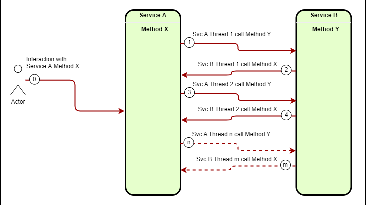
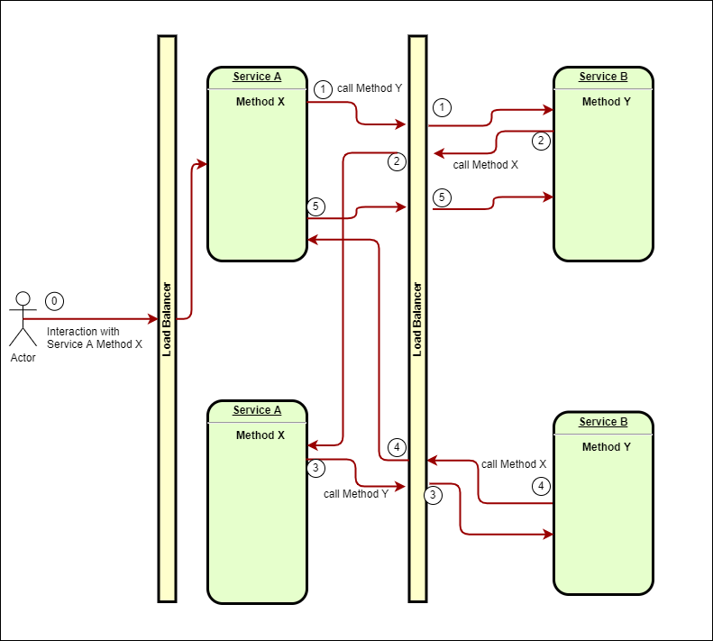

# Distributed Loop

What distributed loop is?

It's like a infinite loop such

```C#
while(true)
{

} 
```

and has some aspects like infinite recursion

```C#
void foo()
{
    foo();
}
```

Infinite recursion stops with stack overflow error but distributed loop don't :(

To imagine what distributed loop is, you have to think in multidimensional way.

In this issue there are at least 2 process or services that conmunicate with each other.
They can communicate in many way such socket, http, web api etc...

## Simple scenario



In this image we can see an example of the simpliest scenario.

- At starting point 0 someone or something interact with Method X of Service A
- Service A start a new thread (thread 1 on Service A) to execute Method X, and at point 1 Method X call Method Y of Service B. (Method X doesn't know the implementation of Method Y)
- Method X at this time is waiting for the response of Method Y
- Service B start a new thread (thread 1 on Service B) to execute the Method Y
- Method Y make a call to Method X of Service A (point 2) and wait for the response

**Remember: in Service A there is thread 1 waiting for Service B response but this isn't a deadlock because service A create a new thread to answer at the new request for Method X.**

- Service A create a new thread (thread 2) to handle the new call to Method X, and in this thread make a call to Method Y of Service B (point 3)

**Note: in Service B there is thread 1 on Method Y that is waitng for an answer from Method X.**

- Service B create a new thread (thread 2) to handle the new call to Method X, and in this thread it make a call to Method Y of Service B (point 4).

And so on...
Every time Service A call Service B ther's a thread in Service A waiting for the answer of service B and viceversa.

If this thing was happened in a single process that hosts both metdhod A and B stack overflow will happens.

In this example service A drain threads and resources on service B and viceversa.

If communication between services is done with http calls or webservies, after some amount of time, every thread waiting for an answer goes in timeout. In our example thread ad point 1 is the first that goes in timeout and gradually happens to every subsequents threads on both Service A or B, but the loop contunue to drain threads and resources because communications are fastest than timeouts and methods continue to call each others.

## Multi instance scenario

In this scenario there is one more dimension.
Service A and Service B are esposed by two instance so there are two instance of Service A and two instance of Service B.
When Service A call Service B don't know wich instance is calling because the incoming calls are managed by a Network Load Balancer.
Remember: NLB distributes calls between instances and caller is unaware.



- Like previous scenario the story start at point 0 where someone or something interact with Method X of Service A but this time services are behind a Network Load Balancer. Assume that NLB redirect the request to Instance 1 of Service A
- Service A start a new thread (thread 1 on Service A on Instance 1) to execute Method X, and at point 1 Method X call Method Y of Service B through NLB
- NLB redirect the request to Instance 1 of Service B
- Method X at this time is waiting for the response of Method Y
- Service B on Instance 1 start a new thread (thread 1 on Service B) to execute the Method Y
- Method Y make a call to Method X of Service A (point 2) and wait for the response
- NLB redirect the request to Instance 2 of Service A
- Service A on Instance 2 create a new thread (thread 1) to handle the call to Method X, and in this thread make a call through NLB to Method Y of Service B (point 3)
- NLB redirect the request to Instance 2 of Service B
- Service B on instance 2 create a new thread (thread 1) to handle the  call to Method Y, and in this thread make a call through NLB to Method X of Service A (point 4).
- NLB redirect the request to Instance 1 of Service A
- Service A on Instance 1 start a new thread (thread 2) to execute the Method Y
- Method X make a call to Method Y of Service A (point 5) and wait for the response
- NLB redirect the request to Instance 1 of Service A

And so on...
In this scenario calls traverse every instance of each Services and like previous example is an infinite loop that drains resources and threads on every instances.

## Auto Scaling scenario

This scenario looks like previous scenario but when same service's instances has few resources, automatically a new instance of the same service will be created.
If the sistem starts with two instances of Service A, when instances goes out of resources a new instance (instance 3) will be created and when instance 3 has few resources a new instance (instance 4) will be created, and so on....
If your instances are on cloud, in a short time you will exausts your maximum resource limit and spend a lot of money :(

## Common cases

## Symptoms

How can you