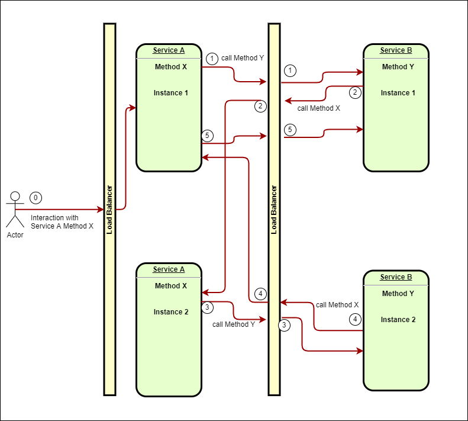

# Distributed Loop

What distributed loop is?

It's like a infinite loop such

```C#
while(true)
{

} 
```

and has some aspects like infinite recursion

```C#
void foo()
{
    foo();
}
```

Infinite recursion stops with stack overflow error but distributed loop don't :(

To imagine what distributed is you have to think in multidimensional way.

In this issue there are at least 2 process or services that conmunicate with each other.
They can communicate in many way such socket, http, web api etc...

## Simple scenario


In this image we can see an example of the simpliest scenario.

- At starting point 0 someone or something interact with method X of Service A
- Service A start a new thread (thread 1 on Service A) to execute Method X, and at point 1 Method X call Method Y of Service B. (Method X doesn't know the implementation of Method Y).
- Method X at this time is waiting for the response of Method Y
- Service B start a new thread (thread 1 on Service B) to execute the Method Y
- Method Y make a call to Method X of Service A (point 2) and wait for the response

**Remember: in Service A there is thread 1 waiting for Service B response but this isn't a deadlock because service A create a new thread to answer at the new request for Method X.**

- Service A create a new thread (thread 2) to handle the new call to Method X, and in this thread make a call to Method Y of Service B (point 3)

**Note: in Service B there is thread 1 on Method Y that is waitng for an answer.**

- Service B create a new thread (thread 2) to handle the new call to Method X, and in this thread make a call to Method Y of Service B (point 4).

And so on...
Every time Service A call Service B lock a thread waiting for the answer of service B and viceversa.

If this thing was happened in a single process that hosts both metdhod A and B stack overflow will happens.

In this example service A drain threads and resources on service B.

If communication between services is done with http calls or webservies after some amount of time every thread waiting for an answer goes in timeout. In our example thread ad point 1 is the first that goes in timeout and gradually every next threads on both Service A or B, but the loop contunue to drain threads and resources because communications are fastest than timeouts and methods continue to call each others.

## Multi instance scenatio


